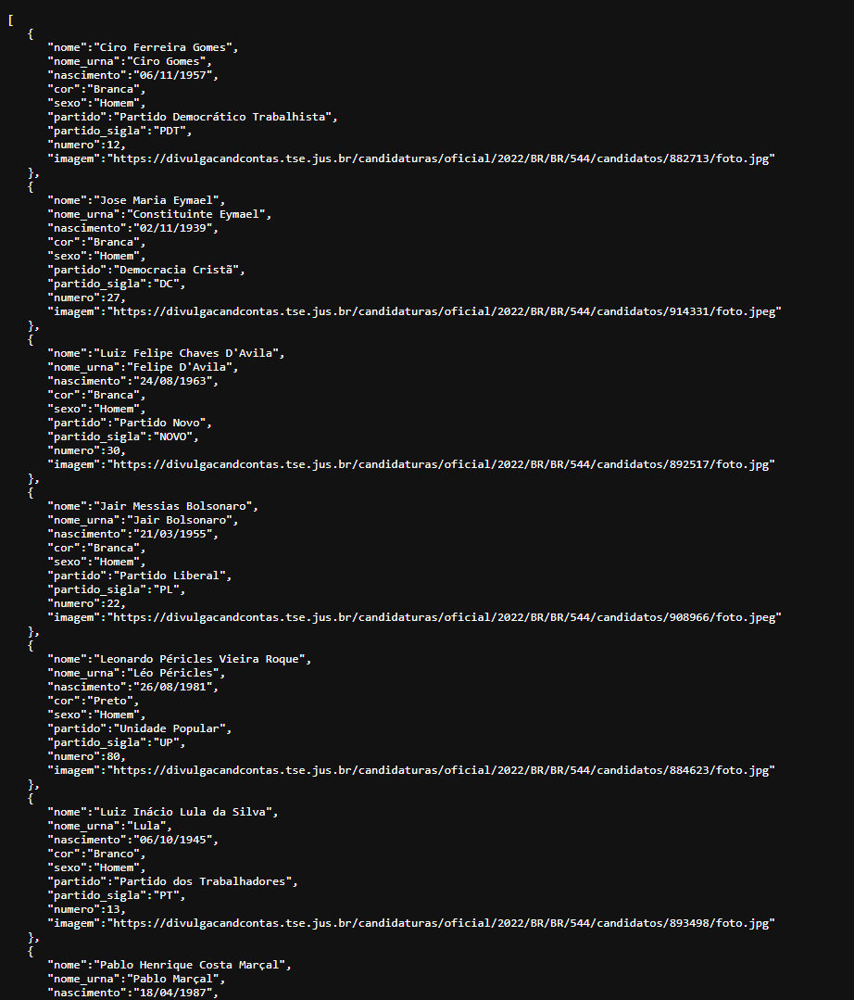

# candidatos-2022
> Uma simples API usando ``express`` para consulta de informações de um arquivo ``JSON``, o intuito do projeto foi apenas para estudo porém eu achei válido deixar público.
 



### Documentação simples:
`GET /candidatos` - Retorna uma lista de todos os candidatos.


`GET /candidato/:numero` - Retorna as informações de um candidato específico. - ``ex: GET /candidato/123/``

```json
    {
    "nome": null,
    "nome_urna": null,
    "nascimento": null,
    "cor": null,
    "sexo": null,
    "partido": null,
    "partido_sigla": null,
    "numero": 0,
    "imagem": null
    }
```


`GET /candidato/:numero/:json_field` - Retorna um dado específico de um candidato específico. - ``ex: GET /candidato/123/imagem``